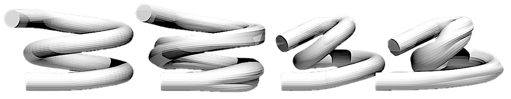

<a href="https://www.imperial.ac.uk/optimisation-and-machine-learning-for-process-engineering/about-us/">

</a>

# Flow Reactor Design Benchmark

[](https://github.com/psf/black) [](https://opensource.org/licenses/MIT) 

- This repository contains a Dockerized Flask application that serves a benchmark for use within **expensive, black-box, and multi-fidelity optimization frameworks**. 
- The Flask application can be accessed via a REST API and supports both single and multi-fidelity evaluations with adjustable CPU usage for parallel simulations.

<div align="center">
    
</div>

## Quickstart (15 minutes) 
0. **[Install Docker](https://docs.docker.com/engine/install/)**

1. **Clone the repository.**
    ```bash
    git clone https://github.com/trsav/reactor_benchmark.git
    cd reactor_benchmark
    ```

2. **Build the Docker image. This will take approximately 10 minutes**
    ```bash
    docker build -t benchmark .
    ```
    If this step fails (i.e. ```ERROR: error getting credentials - err: exit status 1, out: ```) you may need to log into Docker first using ```$ docker login``` 

3. **Run the Docker image.**
    ```bash
    docker run -p 5001:5001 benchmark
    ```

4. **Send a POST request to the Flask application (```reactor_design_problem/test_eval.py```).**
    ```python
    import requests
    import json
    import numpy as np

    url = "http://localhost:5001/cross_section"
    d = {"x": list(np.random.uniform(0, 1, 36)), "z": [0.5, 0.5], "keep_files": False, "cpus": 2}
    headers = {"Content-Type": "application/json"}
    response = requests.post(url, headers=headers, data=json.dumps(d))
    print(response.text)
    ```

Refer to the function description in the code for more information about the `x`, `z`, `keep_files`, and `cpus` parameters.
### Notes 

- To perform single fidelity evaluations either omit ```z``` from the POST dictionary (in which case the simulation will be performed with fidelities ```[0.75,0.75]```) or choose your own values and keep track of them!
- Lower fidelities will be quicker to evaluate, but will probably provide simpler, more flat objective functions.
- A property of this problem is that lower fidelities are significantly biased from higher fidelities, providing consistently higher objective values. 

## Functions available

| Endpoint | Description | Variables | Fidelities (Optional) |
| -------- | ----------- | --------- | ---------- |
| ```/cross_section```  | Variables define inducing points that specify the cross section of the reactor throughout the length. Simulations are performed under steady-flow conditions. The objective returned is the equivalent tanks-in-series of the reactor plus a penalty that penalises non-symmetric residence time distributions.   |  $\mathbf{x}\in [0,1]^{36}$ | $\mathbf{z}\in[0,1]^2$           |
| ```/cross_section_pulsed_flow```  | Same variables as ```cross_section```, in addition to three operating conditions that define the amplitude, frequency, and Reynolds number of the inlet boundary conditions (```x[0],x[1],x[2]``` respectively).  |  $\mathbf{x}\in [0,1]^{39}$ | $\mathbf{z}\in[0,1]^2$           |
| ```/path```  | Variables describe deviations in coil path, in cylindrical coordinates, allowing the path of the reactor to vary.  |  $\mathbf{x}\in [0,1]^{11}$ | $\mathbf{z}\in[0,1]^2$           |
| ```/path_pulsed_flow```  | Same variables as ```path```, in addition to three operating conditions that define the amplitude, frequency, and Reynolds number of the inlet boundary conditions  |  $\mathbf{x}\in [0,1]^{14}$ | $\mathbf{z}\in[0,1]^2$           |
| ```/full```  | A combination of coil path and cross section.|  $\mathbf{x}\in [0,1]^{47}$ | $\mathbf{z}\in[0,1]^2$           |
| ```/full_pulsed_flow```  | A combination of coil path, cross section, and pulsed-flow operating condition.|  $\mathbf{x}\in [0,1]^{50}$ | $\mathbf{z}\in[0,1]^2$           |

## System Requirements

- Docker (if using Windows, you will need to install WSL)
- This software has been tested on a 2019 Macbook Pro, and a Windows PC.
- 

## Key Features
- **Flexible**: Supports both single and multi-fidelity evaluations.
- **Parallelizable**: Can adjust CPU usage for parallel simulations.
- **Easy to use**: Accessible via a REST API.


## License
This project is licensed under the terms of the MIT license.
